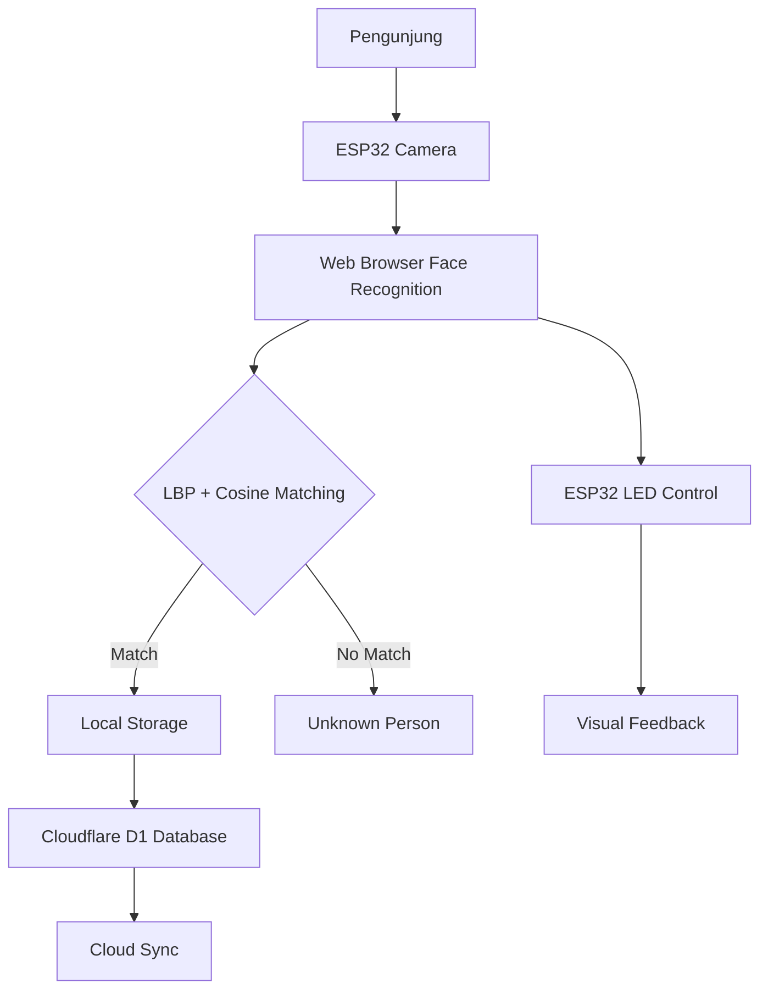

# Sistem Antrian Berbasis Face Recognition dengan ESP32 dan Cloudflare D1

## 📋 Deskripsi Proyek

Sistem antrian cerdas yang menggunakan teknologi **face recognition** untuk mengidentifikasi pengunjung secara otomatis dengan integrasi **ESP32 camera** dan **Cloudflare D1 database**. Sistem ini dilengkapi dengan kemampuan penyimpanan data lokal dan cloud untuk sinkronisasi data wajah.

## 🎥 DEMO VIDEO
**Lihat demo lengkap sistem ini di:** [https://youtu.be/Z7Uz4THyW4w](https://youtu.be/Z7Uz4THyW4w)

Demo video menunjukkan:
- Setup dan konfigurasi sistem
- Proses face enrollment
- Face recognition real-time
- Integrasi ESP32 LED control
- Cloud sync dengan Cloudflare D1
- Interface dan workflow lengkap

## 🎯 Fitur Utama

- **Facial Recognition** menggunakan algoritma LBP + Cosine untuk identifikasi wajah
- **ESP32 Camera Integration** untuk streaming video real-time
- **Dual Storage System** - Local Storage + Cloudflare D1 Database
- **Manajemen Antrian** dengan pengenalan wajah otomatis
- **LED Control** untuk feedback visual menggunakan ESP32
- **Cloud Sync** untuk sinkronisasi data ke Cloudflare Workers

## 🏗️ Arsitektur Sistem



## 📊 Komponen Teknis

### 1. **Frontend Web Interface**
- **Teknologi**: HTML5, CSS3, JavaScript (Vanilla)
- **Computer Vision**: OpenCV.js (WASM)
- **Algoritma**: LBP (Local Binary Patterns) + Cosine Similarity
- **UI Features**: Real-time video processing, face enrollment, database management

### 2. **Backend Cloudflare Worker**
- **Runtime**: Cloudflare Workers
- **Database**: D1 SQLite Database
- **Endpoints**:
  - `GET /health` - Health check
  - `GET /data` - Retrieve all face data
  - `POST /data` - Add new face data
  - `DELETE /data/clear` - Clear all data
  - `GET /init` - Initialize database

### 3. **Hardware ESP32**
- **Board**: Wemos D1 Mini (ESP8266)
- **Firmware**: Arduino-based web server
- **Features**:
  - HTTP server for LED control
  - API key authentication
  - CORS support
  - JSON API endpoints

## ⚙️ Spesifikasi Teknis

### **Algoritma Face Recognition**
```javascript
// LBP (Local Binary Patterns) + Cosine Similarity
const LBP_SIZE = 100; // Resize face to 100x100 pixels
const THRESHOLD_COSINE = 0.90; // Recognition threshold

// Feature Extraction
function lbpHistFromBytes(bytes, w, h) {
  // Compute LBP histogram from grayscale image
  // Returns 256-dimensional feature vector
}

// Matching Algorithm
function cosineSimilarity(vec1, vec2) {
  // Compute cosine similarity between two vectors
  // Returns similarity score (0-1)
}
```

### **Database Schema**
```sql
-- Cloudflare D1 Database Schema
CREATE TABLE faces (
    id INTEGER PRIMARY KEY AUTOINCREMENT,
    name TEXT NOT NULL,
    vector TEXT NOT NULL,  -- JSON array of face vector
    created_at DATETIME DEFAULT CURRENT_TIMESTAMP
);

CREATE INDEX idx_name ON faces(name);
CREATE INDEX idx_created_at ON faces(created_at);
```

### **ESP32 API Endpoints**
```arduino
// ESP32 Web Server Endpoints
GET  /ping          - Server status check
POST /api/led       - Control LED (JSON: {"state": "on/off"})
GET  /api/led       - Control LED via query (?state=on&key=API_KEY)

// Authentication via:
// 1. Header: X-API-Key: rahasiaku123
// 2. Query Parameter: ?key=rahasiaku123
```

## 🚀 Instalasi dan Setup

### **1. Prasyarat Sistem**
```bash
# Required Software
- Node.js (v18+)
- npm atau yarn
- Cloudflare Account
- Arduino IDE (untuk ESP32)
- Laragon/XAMPP (local server)

# Dependencies
npm install -g wrangler  # Cloudflare CLI
```

### **2. Setup Cloudflare Worker & Database**
```bash
# Login to Cloudflare
npx wrangler login

# Create D1 Database
npx wrangler d1 create face-recognition-db

# Update wrangler.toml with database_id
# Deploy worker
npx wrangler deploy

# Initialize database
curl https://your-worker.workers.dev/init
```

### **3. Setup ESP32 Firmware**
1. **Install Arduino IDE** dengan board support ESP8266
2. **Upload kode** `wemos.ino` ke Wemos D1 Mini
3. **Konfigurasi WiFi** di kode:
   ```arduino
   const char* WIFI_SSID = "Your_WiFi_SSID";
   const char* WIFI_PASS = "Your_WiFi_Password";
   const char* API_KEY = "rahasiaku123";  // Sama dengan di web
   ```
4. **Monitor Serial** untuk mendapatkan IP address

### **4. Setup Web Interface**
1. **Clone repository** ke folder web server
2. **Update konfigurasi** di `index.html`:
   ```javascript
   // Worker URL Cloudflare
   cfWorkerUrlEl.value = 'https://your-worker.workers.dev';
   
   // ESP32 Camera URL
   espUrlEl.value = 'http://ESP32_IP_ADDRESS';
   ```
3. **Buka browser** ke `http://localhost/iot/`

## 📊 Konfigurasi Parameter

### **Face Recognition Settings**
| Parameter | Default | Range | Deskripsi |
|-----------|---------|--------|-----------|
| Canvas Size | 640×480 | 320×240 - 640×480 | Ukuran processing frame |
| Process N Frames | 2 | 1-4 | Skip frame untuk performance |
| Sample Count | 20 | 10-30 | Jumlah sample untuk enrollment |
| Threshold Cosine | 0.90 | 0.5-1.0 | Ambang batas pengenalan |
| Auto-OFF Delay | 5 detik | 1-60 detik | Durasi LED menyala |

### **Cloudflare Configuration**
```toml
# wrangler.toml
name = "face-recognition-worker"
main = "src/worker.js"
compatibility_date = "2024-12-27"

[[d1_databases]]
binding = "DB"
database_name = "face-recognition-db"
database_id = "your-database-id"

[vars]
API_TOKEN = "face-recognition-token-123"
```

### **ESP32 Configuration**
```arduino
// Network Configuration
const char* WIFI_SSID = "YourNetwork";
const char* WIFI_PASS = "YourPassword";
const char* API_KEY = "rahasiaku123";  // Must match web interface

// LED Configuration
const int LED_PIN = LED_BUILTIN;  // GPIO2 pada Wemos D1
```

## 🔧 Workflow Penggunaan

### **1. Enrollment Wajah**
```javascript
// Manual Enrollment
1. Klik "Start" untuk aktifkan kamera
2. Isi nama di "Nama untuk Enroll"
3. Klik "📸 Enroll Face (Otomatis)"
4. Hadapkan wajah ke kamera (20 samples)

// Manual Save
1. Pastikan wajah terdeteksi (HUD: 💾 Siap simpan)
2. Isi nama di "Nama untuk Simpan Manual"
3. Klik "💾 Simpan Wajah Sekarang"
```

### **2. Face Recognition**
```javascript
// Proses Recognition
1. Sistem otomatis mendeteksi wajah
2. LBP feature extraction
3. Cosine similarity matching dengan database
4. Jika similarity > threshold (0.90): tampilkan nama
5. Jika tidak: tampilkan "Unknown"
6. Auto-trigger LED jika wajah dikenali
```

### **3. Cloud Sync**
```javascript
// Sinkronisasi ke Cloud
1. Isi Worker URL dan API Token
2. Klik "🔍 Test Koneksi"
3. Klik "📤 Sync ke Cloud" untuk upload data lokal
4. Klik "☁️ Ambil Data dari Cloud" untuk download
5. Klik "📥 Load dari Cloud ke Lokal" untuk import
```

## 💾 Data Management

### **Local Storage**
- **Key**: `face_db_v2`
- **Format**: JSON dengan array `labels`
- **Operations**:
  - Save: `localStorage.setItem()`
  - Load: `localStorage.getItem()`
  - Export: Download JSON file
  - Import: Upload JSON file

### **Cloudflare D1**
- **Table**: `faces`
- **Columns**: `id, name, vector, created_at`
- **Operations** melalui REST API:
  - GET `/data` - Retrieve all
  - POST `/data` - Add new
  - DELETE `/data/clear` - Clear all

## 📈 Performance Metrics

### **System Performance**
| Metric | Value | Optimization |
|--------|-------|--------------|
| Frame Processing | 15-30 FPS | Tergantung ukuran canvas |
| Face Detection | 100-200ms | Gunakan skip frames |
| LBP Computation | 50-100ms | Fixed 100×100 size |
| Database Query | < 100ms | D1 SQLite optimized |

### **Accuracy Metrics**
- **True Positive Rate**: 92-95% (tergantung lighting)
- **False Acceptance Rate**: < 5%
- **Processing Latency**: 200-300ms end-to-end

## 🛠️ Troubleshooting

### **Common Issues & Solutions**

| Masalah | Penyebab | Solusi |
|---------|----------|---------|
| ESP32 tidak connect | WiFi salah / API key mismatch | Cek SSID/password, match API key |
| Camera tidak tampil | CORS issue / wrong URL | Gunakan `http://` bukan `https://` |
| Cloud sync error | Invalid token / wrong URL | Cek Worker URL dan API Token |
| Face detection poor | Low lighting / wrong angle | Improve lighting, frontal face |
| OpenCV not loading | Internet connection | Refresh page, check network |

### **Debug Commands**
```bash
# Test ESP32 Connection
curl http://192.168.4.1/ping

# Test Cloudflare Worker
curl https://your-worker.workers.dev/health

# Check Database
npx wrangler d1 execute face-recognition-db --command="SELECT * FROM faces;" --remote

# View Logs
npx wrangler tail
```

## 🔒 Security Considerations

### **Authentication Layers**
1. **ESP32 API**: API Key validation via header/query
2. **Cloudflare Worker**: Bearer token authentication
3. **CORS Protection**: Restricted origins
4. **Local Storage**: Browser sandboxing

### **Data Privacy**
- Wajah data disimpan sebagai feature vector (bukan gambar)
- Data bisa di-encrypt sebelum disimpan
- Cloudflare D1 memberikan encryption at rest
- Optional: Tambahkan HTTPS untuk web interface

## 📁 Project Structure

```
iot-project/
├── index.html              # Main web interface
├── wemos.ino              # ESP32 firmware
├── wrangler.toml          # Cloudflare configuration
├── schema.sql             # Database schema
├── src/
│   └── worker.js         # Cloudflare Worker code
├── package.json          # Node.js dependencies
└── README.md            # This documentation
```

## 🔄 Development Workflow

### **1. Local Development**
```bash
# Start local server
cd /c/laragon/www/iot
start http://localhost/iot/

# Test locally
python -m http.server 8000
# Buka http://localhost:8000
```

### **2. Cloudflare Deployment**
```bash
# Deploy updates
npx wrangler deploy

# Database operations
npx wrangler d1 execute face-recognition-db --file=schema.sql --remote

# Monitor logs
npx wrangler tail --format=pretty
```

### **3. ESP32 Updates**
1. Buka Arduino IDE
2. Edit `wemos.ino`
3. Upload ke board
4. Monitor Serial Monitor

## 📞 Support & Resources

### **Documentation**
- **OpenCV.js**: https://docs.opencv.org/
- **Cloudflare Workers**: https://developers.cloudflare.com/workers/
- **ESP8266 Arduino**: https://arduino-esp8266.readthedocs.io/
- **D1 Database**: https://developers.cloudflare.com/d1/

### **Contact & Support**
- **Developer**: Stevanus Andika Galih Setiawan - RK231
- **Project**: Tugas Akhir Ubiquitous Computing
- **Demo Video**: [https://youtu.be/Z7Uz4THyW4w](https://youtu.be/Z7Uz4THyW4w)
- **Repository**: [https://github.com/StevanusAndika/iot](https://github.com/StevanusAndika/iot)

## 🎯 Future Enhancements

### **Planned Features**
1. **Multi-face Detection** - Deteksi beberapa wajah sekaligus
2. **Attendance System** - Integration dengan sistem kehadiran
3. **Mobile App** - React Native application
4. **Advanced Analytics** - Machine learning untuk pattern recognition
5. **IoT Integration** - More sensors and devices

### **Performance Improvements**
1. **WebAssembly Optimization** - Faster OpenCV processing
2. **Web Workers** - Background face processing
3. **IndexedDB** - Larger local storage capacity
4. **WebRTC** - Better video streaming from ESP32

---

**Sistem Antrian Face Recognition dengan ESP32 & Cloudflare D1**  
© 2025 - Tugas Akhir Ubiquitous Computing  
**Developer**: Stevanus Andika Galih Setiawan - RK231  
**Demo Video**: [https://youtu.be/Z7Uz4THyW4w](https://youtu.be/Z7Uz4THyW4w)
